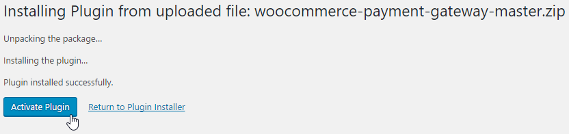
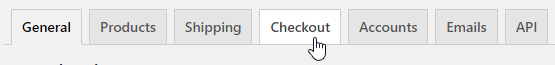
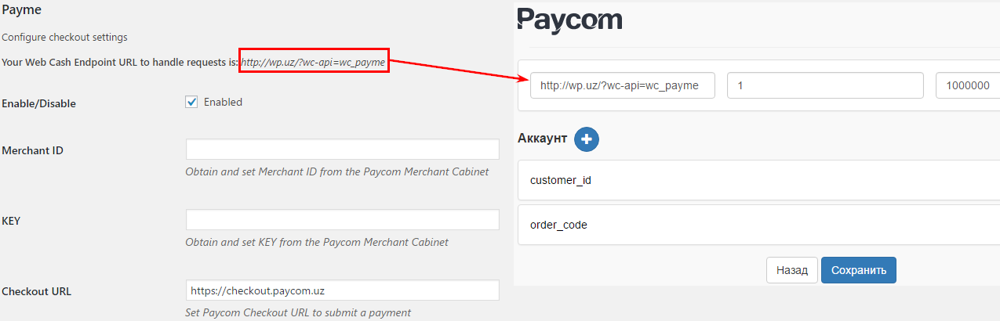

# WooCommerce plugin for LinkPay

## Installation

#### Requirements

- PHP >= 5.4
- [WordPress 4.x](https://wordpress.org/)
- [WooCommerce 3.x](https://woocommerce.com/)
- Registration in the cabinet of the supplier [Linkpay](http://www.linkpay.id/)

#### GitHub

Download the plugin as [ZIP archive](https://github.com/LinkPay/woocommerce-payment-gateway/releases/latest)

Download the plugin in WordPress


... and install it


Activate the plug-in after installation



#### That Apache did not ignore the header `Authorization` you must upload a file `.htaccess` сabout the following content:

```
RewriteEngine On
RewriteCond %{HTTP:Authorization} ^(.*)
RewriteRule .* - [e=HTTP_AUTHORIZATION:%1]
```

in the root directory of the site

Open the WooCommerce settings page


Click the `Checkout`



Click the `Payme` and enter the required data.


Copy your `Endpoint URL` and enter it in the cabinet of the LinkPay provider.


